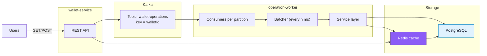

# 💸 Legendary Wallet 

High-load wallet system: a REST API for receiving operations and a background worker for asynchronous processing via Kafka, with transactional persistence in PostgreSQL and caching in Redis.
Special focus - **correctness under 1000 RPS per wallet**, strict ordering, and idempotency.

## 🔧 Tech Stack


---

## 📁 Repository Structure

```
│  .env                 
│  docker-compose.yml   
│  LICENSE
│
├─ migrations/          # SQL initialization of DB (initdb or migrator)
│    001_init.sql
│
├─ operation-worker/
│   ├─ cmd/
│   └─ internal/
│       ├─ app/ broker/ cache/ config/ database/ models/
│       ├─ repositories/
│       │   ├─ postgresrepo/
│       │   └─ redisrepo/
│       ├─ services/
│       └─ worker/
│
└─ wallet-service/
    ├─ cmd/
    ├─ docs/            # Swagger
    └─ internal/
        ├─ app/ broker/ cache/ config/ database/ models/
        ├─ repositories/
        │   ├─ kafkarepo/
        │   ├─ postgresrepo/
        │   └─ redisrepo/
        ├─ services/
        └─ transport/http
```

---

## 🚀 Quick Start

### 1) Configure environment variables

Create a `.env` file in the project root based on `config.env`.

### 2) Launch the system

```bash
docker compose up --build
```

---
## 🔍 Useful Dev Tools

| Tool                                                                                                          | URL                                                            | Description                                       |
| ------------------------------------------------------------------------------------------------------------- | -------------------------------------------------------------- | ------------------------------------------------- |
|          | [http://localhost:8080/swagger](http://localhost:8080/swagger) | REST API documentation                            |
|         | [http://localhost:9000](http://localhost:9000)                 | Web UI for Kafka topics, partitions, and messages |
|  | `localhost:5432`                                               | Primary transactional database                    |
|                       | `localhost:6379`                                               | Cache and fast lookup store                       |              |

---

## 🌐 API

### Routes

```go
POST /api/v1/wallets                                      // create a new wallet
GET  /api/v1/wallets/{walletId}                           // get wallet balance
POST /api/v1/wallet                                       // create operation (DEPOSIT/WITHDRAW)
GET  /api/v1/wallets/{walletId}/operations/{operationId}  // get operation status

GET  /swagger/index.html                                  // Swagger UI
```

---

## 🧵 Processing Flow (Kafka) and Concurrency

* The number of Kafka **partitions** defines the number of consumer goroutines.
* Every **100ms**, the batcher collects accumulated messages and **groups them by `walletId`**.
* For each wallet, the service layer:

  1. Locks the wallet row using a `SELECT ... FOR UPDATE` inside a transaction.

  2. Fetches the list of operations from DB and **skips already processed ones** (idempotency, restart safety).

  3. Applies new operations **in Kafka order**:

     * `DEPOSIT` — increases balance
     * `WITHDRAW` — checks funds; if insufficient → marks as `FAILED` with reason

  4. Bulk updates operation statuses, updates the wallet balance, and commits the transaction.

  5. Updates the Redis cache and **commits the Kafka offset**.
* Kafka delivery is **at-least-once**. Combined with idempotency and status checks, it provides **domain-level exactly-once** behavior.

---

## 🧭 Architecture Diagram (Mermaid)



---


