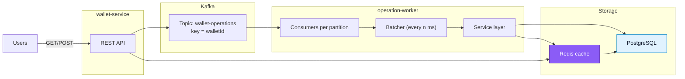

---

# Legendary Wallet (API + Operation Worker)

Высоконагруженная система кошельков: REST-API для приёма операций и воркер для асинхронной обработки через Kafka с транзакционной записью в PostgreSQL и кэшированием в Redis. Особое внимание — корректности под 1000 RPS на один кошелёк, строгому порядку и идемпотентности.

## 🔧 Стек

* **Golang**
* **PostgreSQL** 
* **Kafka** 
* **Redis** 
* **Docker / docker-compose**
* **Swagger/OpenAPI** 

---

## 📁 Структура репозитория

```
│  .env                 
│  docker-compose.yml   
│  LICENSE
│
├─ migrations/          
│    001_init.sql
│
├─ operation-worker/
│   ├─ cmd/
│   └─ internal/
│       ├─ app/ broker/ cache/ config/ database/ models/
│       ├─ repositories/
│       │   ├─ postgresrepo/
│       │   └─ redisrepo/
│       ├─ services/
│       └─ worker/
│
└─ wallet-service/
    ├─ cmd/
    ├─ docs/            # Swagger
    └─ internal/
        ├─ app/ broker/ cache/ config/ database/ models/
        ├─ repositories/
        │   ├─ kafkarepo/
        │   ├─ postgresrepo/
        │   └─ redisrepo/
        ├─ services/
        └─ transport/http
```

---

## 🚀 Быстрый старт

### 1) Настроить переменные окружения
Создай файл `.env` в корне проекта на основе файла `config.env`

### 2) Поднять систему

```bash
docker compose up --build
```

---

## 🌐 API

### Роуты

```go
POST /api/v1/wallets                          // создать новый кошелёк
GET  /api/v1/wallets/{walletId}               // получить баланс
POST /api/v1/wallet                           // создать операцию (DEPOSIT/WITHDRAW)
GET  /api/v1/wallets/{walletId}/operations/{operationId} // статус операции

GET  /swagger/ ...                            // Swagger UI
```

## 🧵 Поток обработки (Kafka) и конкуррентность

* По количеству **партиций** создаются читателей Kafka - каждый в своей горутине.
* Каждые **100ms** батчер забирает накопившиеся сообщения и **группирует по `walletId`**.
* Для каждого кошелька сервисный слой:

  1. В транзакции `SELECT ... FOR UPDATE` блокирует строку кошелька.
  2. Получает список операций из БД и **пропускает уже обработанные** (идемпотентность, случай рестарта).
  3. Последовательно применяет операции **в порядке Kafka**:

     * `DEPOSIT` — увеличивает баланс
     * `WITHDRAW` — проверяет достаточность средств; при нехватке — `FAILED` с причиной
  4. Массово обновляет статусы операций, обновляет баланс, коммитит транзакцию.
  5. Обновляет кэш в Redis и **коммитит оффсет** в Kafka.
* Доставка из Kafka — **at-least-once**. Идемпотентность и проверка статусов дают поведение «как exactly-once» на уровне домена.

---

## 🧭 Диаграмма архитектуры (Mermaid)



---


